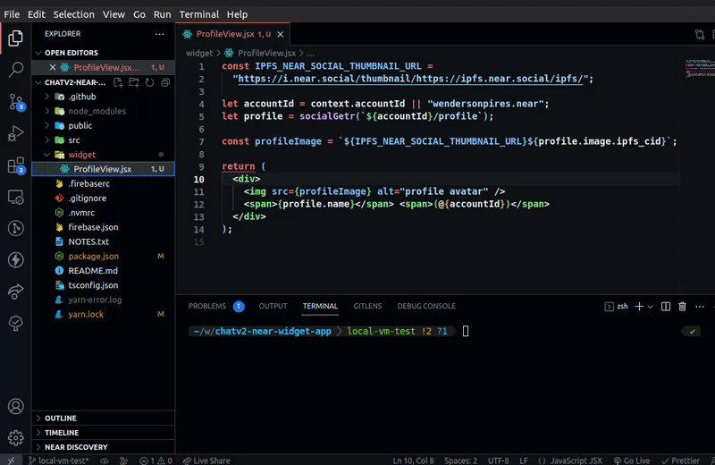

<p align="center">
  
</p>

#  NEAR Social Local Viewer

[](https://github.com/wpdas/near-social-local-viewer/actions?query=workflow%3Apublish)
[](https://www.npmjs.com/package/near-social-local-viewer)
[](https://www.npmjs.com/package/near-social-local-viewer)

A CLI tool that allows you to run and test your Near Social Widgets locally using just your preferred code editor and your default browser.

Tool intended only for Widgets that will run within [Near Social](https://alpha.near.org/)

**Install it using npm or yarn:**

```
# npm
npm install near-social-local-viewer --save-dev

# yarn
yarn add near-social-local-viewer -D
```

## Starting the Viewer

You can start by running the following command:

```
npx init-viewer path/to/MyWidget.jsx
```

The Viewer is going to open automatically on your default browser on port 3001.

## Changing the Viewer PORT

You can change the viewer port:

```
VIEWER_PORT=3005 npx init-viewer widget/ProfileView.tsx
```

## Widget example

Profile View

```jsx
const IPFS_NEAR_SOCIAL_THUMBNAIL_URL =
  "https://i.near.social/thumbnail/https://ipfs.near.social/ipfs/";

const accountId = context.accountId || "wendersonpires.near";
const profile = socialGetr(`${accountId}/profile`);

const profileImage = `${IPFS_NEAR_SOCIAL_THUMBNAIL_URL}${profile.image.ipfs_cid}`;
console.log(profileImage);

return (
  <div>
    
    <span>{profile.name}</span> <span>(@{accountId})</span>
  </div>
);
```

## Good to know

This project was inspired by [NearSocial Viewer](https://github.com/NearSocial/viewer)
